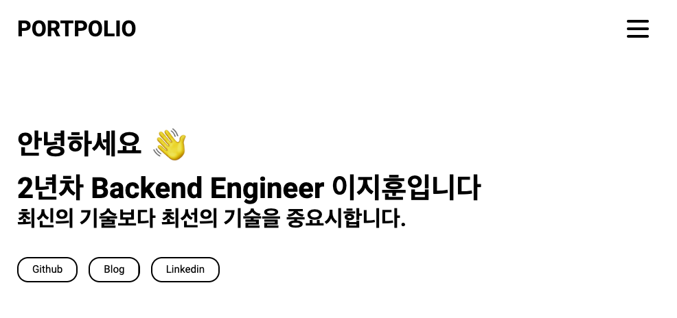

# Gatsby Starter Portfolio Minimal을 사용하였습니다.

---



---

## Sections

5개의 섹션으로 나눠져있습니다.

**The predefined sections are:**

1. Introduce
2. Skills
3. My Projects
4. Contact me
5. Medium articles

---

## How to Start

With Portfolio Minimal, you get up and running in just a few minutes.

1. **Install the Gatsby CLI.**

   ```
   npm install -g gatsby-cli
   ```

2. **Create a new Gatsby site with the Portfolio Minimal starter.**

   ```
   gatsby new portfolio-minimal https://github.com/konstantinmuenster/gatsby-starter-portfolio-minimal
   ```

3. **Start the site in `develop` mode.**

   ```
   cd portfolio-minimal
   gatsby develop
   ```

4. **Mac M1 sharp 패키지 에러 발생 시**

   ```
   brew install pkg-config glib zlib
   brew install libjpeg-turbo libpng webp
   brew install vips
   npm install
   npm run start
   ```

---

## Edit Content

마음대로 커스터마이징 하세요.

### Edit configuration

주로 index.js에서 수정을 하게 되실겁니다.

```
|-- config
    |-- index.js
```

Navigate to the `index.js` file in the config folder, edit the configuration, save it, that's it!

### Edit page content

Content 하부의 디렉토리에서 코드를 고치시면 됩니다.

```
|-- content
    |-- imprint
    |-- index
       |-- about
       |-- contact
       ...
    ...
```

자세한 내용은 Gatsby 공식 Docs를 살펴보세요. <a href="https://www.gatsbyjs.org/docs/mdx/markdown-syntax/" target="_blank">Gatsby's docs</a>. 또한 이 문서도 있습니다. <a href="https://www.gatsbyjs.org/docs/mdx/writing-pages/" target="_blank">further information about MDX</a>.


---

## Edit Theme

테마를 바꿀 수 있으며, configuration file을 바꾸면 됩니다. 위치는 : `config/index.js`.

---

## License

Distributed under the [MIT](http://showalicense.com/?fullname=Konstantin+M%C3%BCnster&year=2019#license-mit) license.

See `LICENSE` for more information.
